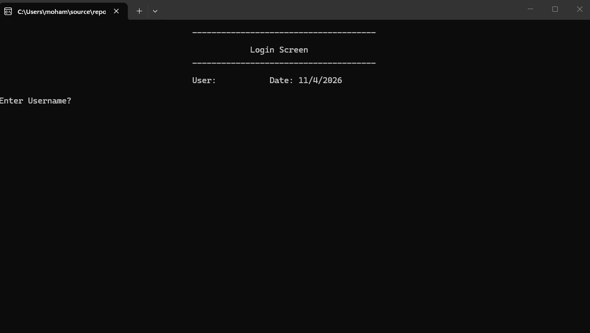
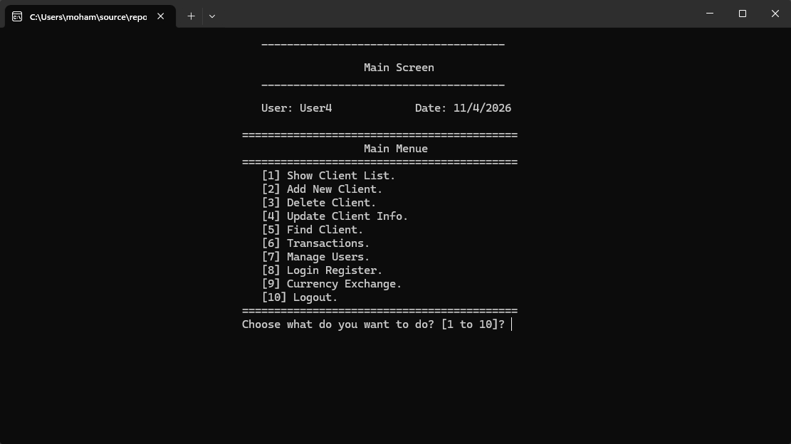
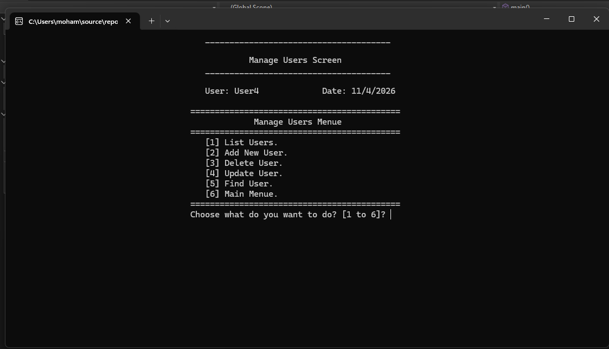
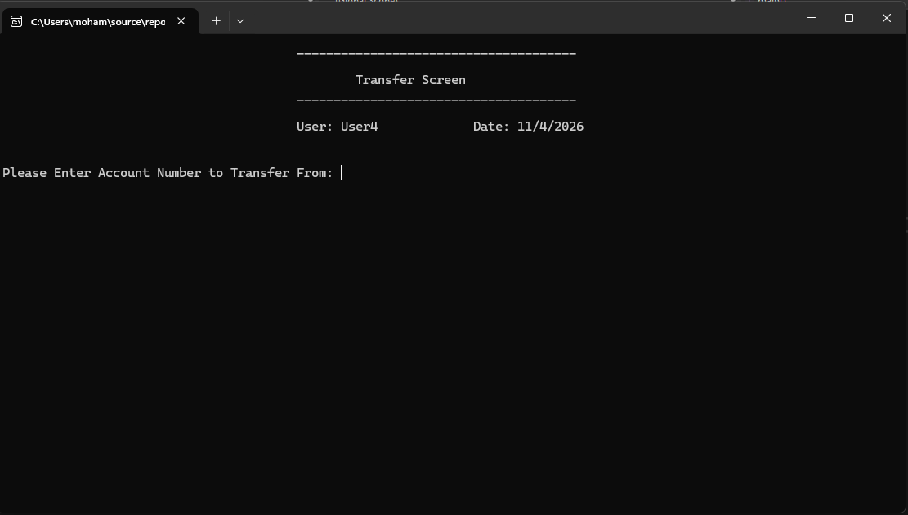
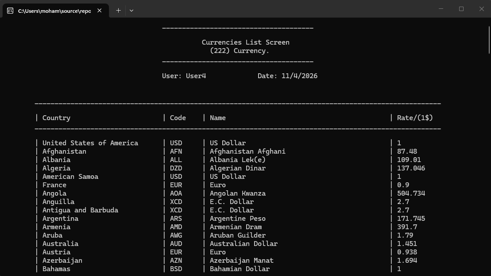

# Bank Management System - OOP Version

A console-based Bank Management System built with **C++**.

This project started as a simple functional-programming bank system, then was redesigned and refactored into an **Object-Oriented Programming (OOP)** project with a better structure, clearer responsibilities, and additional features.

## Project Evolution

### Old Version
The old version was built using a more **functional programming** style and focused mainly on:
- Client management
- User login
- Permissions
- Deposit / Withdraw operations
- File handling using text files

### New Version
The new version was redesigned using **OOP** and organized into multiple classes and screens, making the project easier to maintain, extend, and understand.

## Features

### Core Banking Features
- List clients
- Add new client
- Update client
- Delete client
- Find client
- Deposit
- Withdraw
- View total balances

### User Management
- User login system
- Manage users
- Permissions-based access control

### New Features Added in the OOP Version
- Refactored the project from functional programming to OOP
- Better project structure using classes
- Separated screens and responsibilities
- Added transfer between clients
- Added transfer log
- Added login register log
- Added currency exchange module
- Added currency calculator
- Added currency search
- Added currency rate update
- Improved input validation

## Project Structure

The project is organized using multiple classes, such as:
- `clsBankClient`
- `clsUser`
- `clsScreen`
- `clsMainScreen`
- `clsTransactionScreen`
- `clsTransferScreen`
- `clsTransferLogScreen`
- `clsLoginScreen`
- `clsLoginRegisterScreen`
- `clsCurrency`
- `clsCurrencyExchangeMainScreen`

## Data Storage

The system uses text files for storage:
- `Clients.txt`
- `Users.txt`
- `TransfersLog.txt`
- `LoginRegister.txt`
- `Currencies.txt`

## Concepts Practiced
- Object-Oriented Programming (OOP)
- File handling
- Separation of concerns
- Access control and permissions
- Console application design
- Basic system modularity

## Technologies Used
- C++
- Visual Studio
- Text file storage

## How to Run
1. Open the project in Visual Studio.
2. Build the solution.
3. Run the project.
4. Make sure the required text files exist in the project directory.
   
## Future Improvements
- Password hashing
- Better error handling
- Database integration
- GUI version
- More secure authentication
- Cleaner folder structure
## Screenshots

### Login Screen

### Main Menu

### Manage Users

### Transfer Screen

### Currency Screen

## Notes
This project is part of my learning journey in C++ and OOP, and I am documenting its development step by step.
